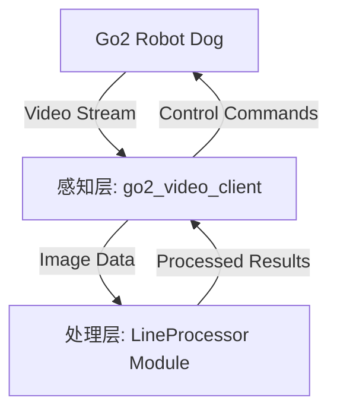

# 睿抗四足多模态赛道 - Go2 机器狗开发仓库

本仓库专为睿抗四足多模态赛道开发，基于 Unitree SDK2 实现 Go2 机器狗的感知、决策与控制。

## 项目架构

本仓库采用模块化设计，旨在解耦视频流获取、图像算法处理与机器狗运动控制。



- **感知与控制中心 (src/go2_video_client.cpp)**: 负责初始化 Unitree SDK2，建立与机器狗的通信，实现视频流获取、状态监控及运动指令下发。
- **图像处理模块 (LineProcessor)**: 封装了各类图像滤波、二值化及形态学处理逻辑，用于识别赛道元素。
- **依赖管理**: 通过 `CMakeLists.txt` 集成 Unitree SDK2 及其底层 DDS 通信库，并依赖 OpenCV 进行图像处理。

## TODO List

以下是本项目计划完成的功能清单，欢迎团队成员贡献代码：

- [x] 沿黑线寻路
    - [x] 图像预处理（已完成）
    - [x] 实时参数调优工具（基于 librealsense2）
    - [ ] 路径计算逻辑
    - [ ] 机器狗运动控制耦合
- [ ] **自动评估系统**：通过比对人工标记的数据，自动评估图像预处理算法的准确度。
- [ ] **自动避障**：识别并绕过赛道上的障碍物。
- [ ] **越障功能**：处理不平整地面或小型障碍。
- [ ] **爬楼梯**：实现稳定的楼梯自主攀爬。
- [ ] **图标识别**：识别赛道中的特定功能图标或指示牌。
- [ ] **特殊动作执行**：根据任务需求执行打招呼、蹲下等预设动作。
- [ ] **机械臂抓取**：实现与机器狗背负/集成机械臂的协同抓取任务。

## 依赖

- Unitree SDK2
- OpenCV 4.x
- librealsense2

## 环境准备

为了方便 AI 阅读 Unitree_SDK2 官方示例和接口，以及构建需要，建议在仓库根目录下创建到 SDK 的软链接：

```bash
ln -s /path/to/your/unitree_sdk2 ./unitree_sdk2
```

## 编译

```bash
mkdir build && cd build
cmake .. -DCMAKE_BUILD_TYPE=Release
make
```


确保机器人和 PC 在同一网络下：

```bash
# 默认使用默认网卡
./go2_video_client

# 也可以指定网卡（如 eth0, wlan0 等）
./go2_video_client eth0
```

按 `q` 或 `Esc` 退出，按 `s` 键抓拍并保存当前画面。

## 模块文档

详细的模块使用说明及接口定义请参阅：

- [LineProcessor 模块使用说明](docs/LineProcessor.md)
